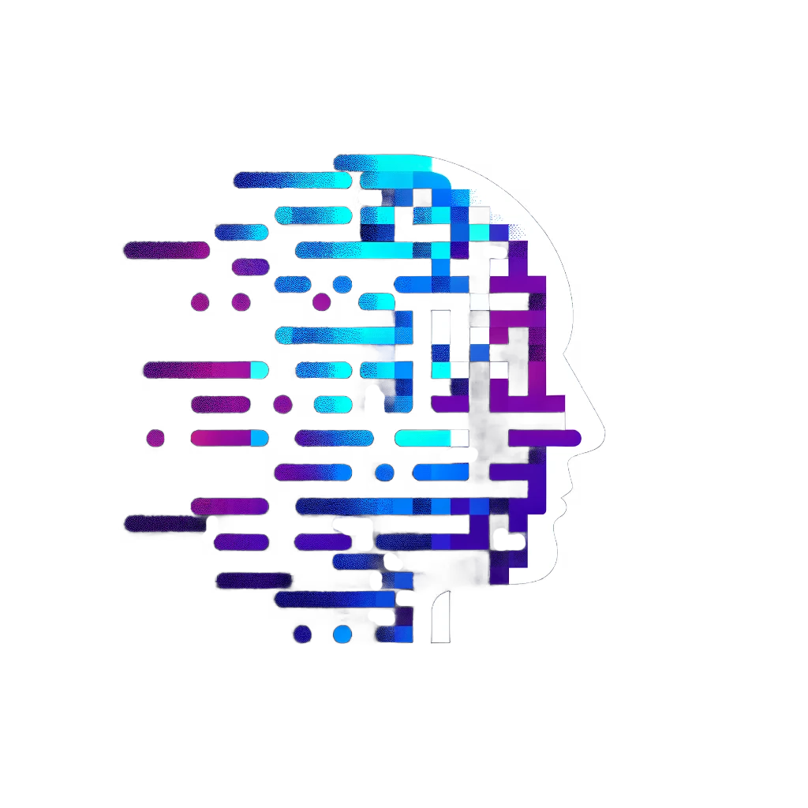
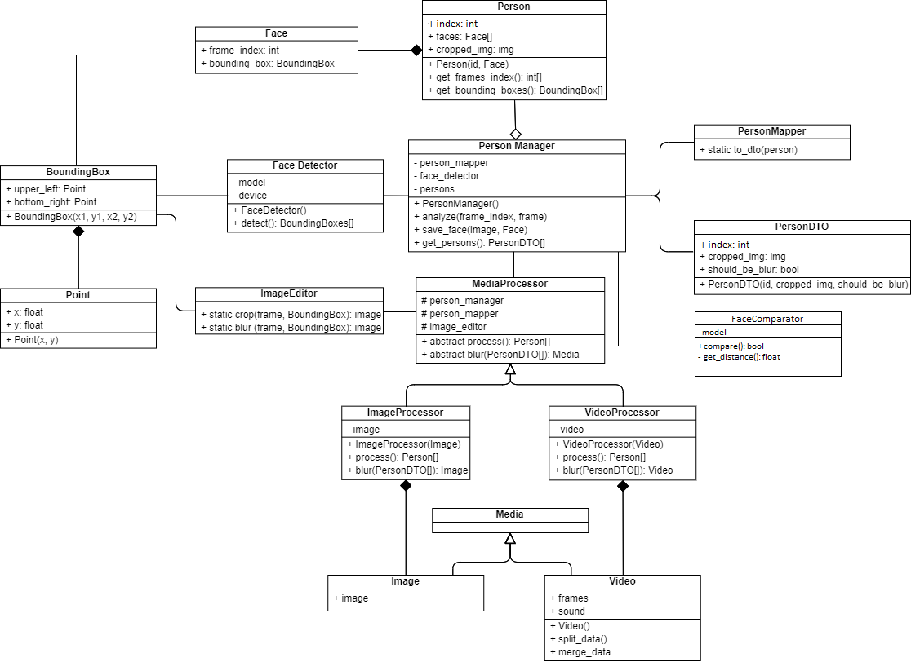

<!-- PROJECT LOGO -->
<br />
<div align="center">
  <a href="https://github.com/Naofel-eal/Computer-vision-project/blob/main/resources/logo.png">
    
  </a>

  <h3 align="center">Blur AI: Anonymize Person Faces with Advanced AI</h3>

  <p align="center">
    An awesome README template to jumpstart your projects!
  </p>
</div>

## Project Overview
Blur AI is an innovative Python application designed to enhance privacy by anonymizing faces in photos and videos. Utilizing a custom-trained YOLOv8n model for face detection and the VGG-Face neural network for face recognition, this tool seamlessly identifies and processes faces in various media forms.

### Key Features
- **Privacy Protection**: Anonymize faces in photos or videos efficiently.
- **Advanced Face Detection**: Utilizes a custom-trained YOLOv8n model for accurate face detection.
- **Reliable Face Recognition**: Employs VGG-Face neural network for precise face comparison.
- **User-Friendly Interface**: Easy-to-use interface for hassle-free operation.

### Dataset
- [Face Detection Dataset](https://www.kaggle.com/datasets/fareselmenshawii/face-detection-dataset/data) used by our YOLOv8n model to detect faces.
- [VGG Face Descriptor](https://www.robots.ox.ac.uk/~vgg/software/vgg_face/) used by our VGG-Face neural network to compare faces.

## Demonstration


## Installation
Note that the application will be really faster if you have a GPU with CUDA installed.

```bash
# Clone the repository
git clone https://github.com/Naofel-eal/Computer-vision-project.git

# Install dependencies
pip install -r requirements.txt

# Launch the application
python main.py
```

## Software Architecture
Below is the UML diagram illustrating the architecture of Blur AI. Note that minor variations may exist due to the project's evolution.



## Technical Specifications
### Face Detection and Recognition
- Advanced algorithms for accurate face detection and recognition.

### Anonymization and Privacy
- Gradual blurring techniques for person anonymization.
- Correction algorithm to minimize false positives.

### User Interface
- Sleek and intuitive GUI for ease of use.
